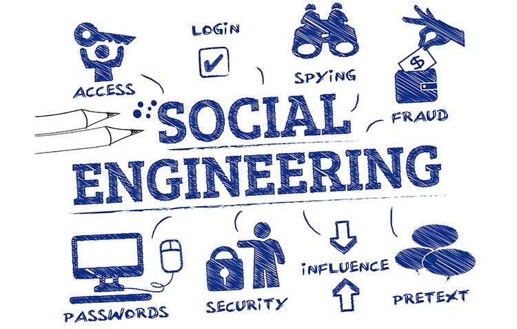
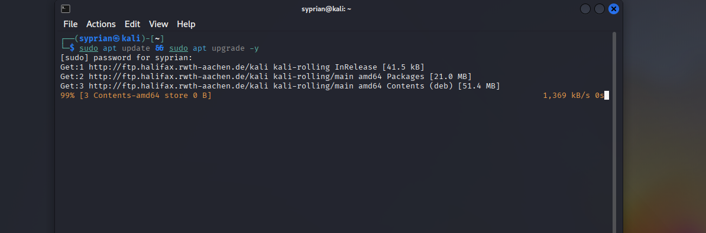
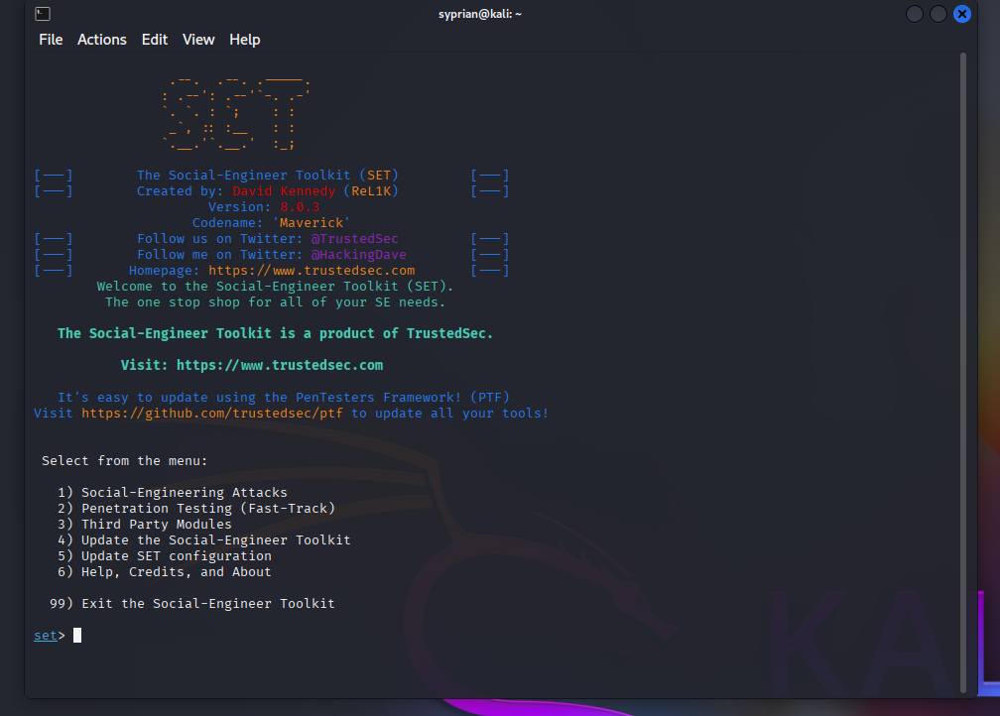
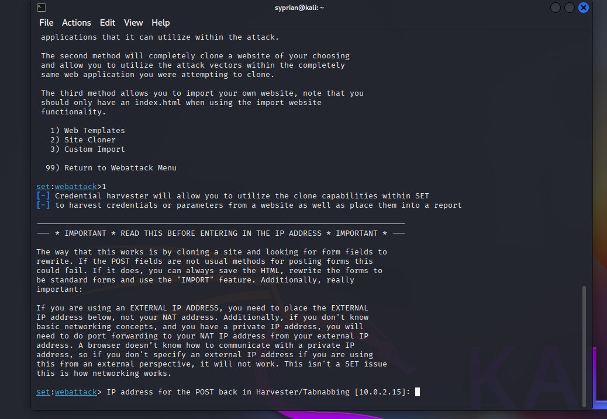
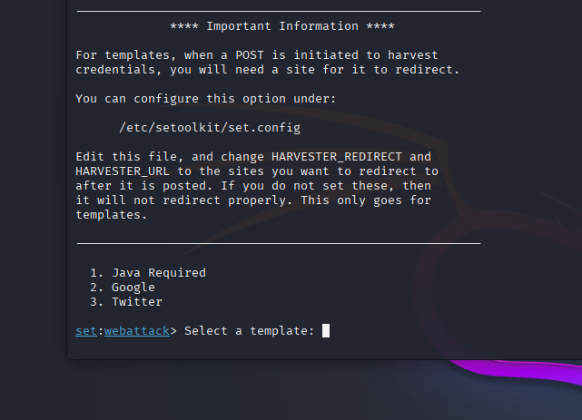
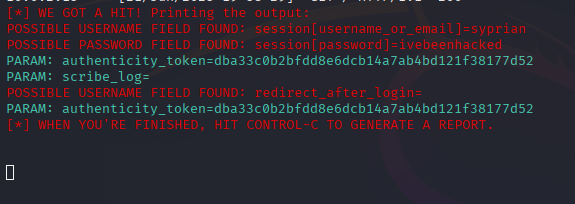

# Social_Engineering_-_Phishing_Simulation

# Project Tittle: SOCIAL ENGINEERING AND PHISHING SIMULATION  

---
Sections to include:

- Objective of the simulation

- Tools used (SET on Kali)

- Methodology (Phishing via cloned site)

- Screenshots (SET output, page clone, logs)

- Recommendations for:

   Security awareness training

   Email filtering

   Reporting suspicious emails

---

## 🎯 Objective
Simulate phishing attacks using SET(Social Engineering ToolKit) to evaluate user awareness and recommend security training improvements.

## 🔐 What is Social Engineering and Phishing??

Social engineering is a manipulative tactic used by attackers to trick individuals into giving up confidential information, 
such as passwords, financial data, or access to systems. Rather than exploiting software vulnerabilities, 
social engineering exploits human psychology — trust, fear, urgency, or curiosity.

Some ommon forms of Social Engineering include:

Phishing: Fake emails or websites that mimic legitimate sources.

Spear Phishing: Personalized phishing aimed at specific individuals.

Vishing: Voice phishing via phone calls.

Smishing: SMS-based phishing attacks.

## 🛠 Tools Used
|     Tool          |	    Purpose       |
|-------------------|-------------------|
|   Kali Linux (VM)	    |Penetration testing OS|
|SET (Social Engineering Toolkit) |	Advanced phishing & social engineering attacks|
|Metasploit (Optional)	|        Payload generation for simulated attacks        |

### Phase 1: Setup & Planning
We Update Kali using this command `sudo apt update && sudo apt install set` or `sudo apt update && sudo apt upgrade -y`

SET (Social Engineering Toolkit) is already installed on Kali, to active or launch it, 

we just run this command `sudo setoolkit`

enter password

Navigate 
- Social-Engineering Attack
- Website Attack Vectors
- Credential Havester Attack Method

  After the above steps, we are suppose to design a phishing campains with email templates to lure the user but since
  this is just for studies purpose, i am not going to create that, but i will display what the user sees once they click the link given in the sent email.

Last step is to if you want to clone a site or use some default web templates that SET already has.

I am going to use the default web templates

I am choosing the X(Twitter) template

SET is going to ask for our IP. Your check the IP of your Kali by using this command `ifconfig` or youll see it before the **`":"`**.

Press enter. 

once we enter our IP, we are ready to monitor and wait for the result when the user opens it.

---

Since i am not phishing anyone now, i will just display what the user will see they click the drafted email template.

You can do this process by just typing your IP address (10.0.2.***) in your browser. 

Once they enter their credentials(username and password), we will be able to see it.

Example: My user login credentials where username: syprian and password:ivebeenhacked

---

---
## 🛡️ Prevention & Mitigation Strategies
### For Organizations:
1. Security Awareness Training
- Teach employees to:

✅ Verify sender addresses (e.g., check for typos like support@micr0soft.com).

✅ Hover over links before clicking.

✅ Report suspicious emails immediately.

2. Enable Multi-Factor Authentication (MFA)

- Even if credentials are stolen, MFA can block unauthorized access.

3. Regular Phishing Simulations
   
Conduct quarterly tests to keep awareness high.

### For Employees:

Never enter credentials on unsolicited links.

Always report suspicious emails to IT.

--- 

## 🎓 Security Awareness Training Tips
1. Interactive Workshops

Use real-world examples (like this simulation).

2. Gamification

Reward employees who report phishing attempts.

3. Monthly Newsletters

Share latest phishing tactics (e.g., QR code phishing).

---
## 🎥 Demo Video  
Check out my project demo on LinkedIn:
[LinkedIn Video](https://www.linkedin.com/posts/ing-cyprian-atsyor-27816421b_cybersecurity-phishingawareness-socialengineering-activity-7341445509124972544-OoH7?utm_source=share&utm_medium=member_desktop&rcm=ACoAADdfvnwBt5lYydkpi8nNtj7ibLzTI9eBV1Y)

---

🔑 Key Takeaway: Always Authenticate Before You Click.
✅ Hover over links to see where they really go
✅ Double-check sender emails for suspicious domains
✅ Never enter credentials unless you're 100% sure the site is legit
✅ When in doubt, report the email to IT/Security

---

## ⚠️ LEGAL & ETHICAL DISCLAIMER
This phishing simulation is strictly for educational and security awareness training purposes.

🔹 Authorized Use Only:
This test was conducted with explicit permission from the organization and targeted only pre-approved test accounts.
Unauthorized phishing attempts are illegal and violate privacy laws (e.g., GDPR, CFAA).

🔹 Do Not Replicate Maliciously:
The tools and techniques demonstrated (GoPhish, SET, etc.) are not to be used for unauthorized attacks.
Real-world phishing harms individuals and organizations. Always obtain consent before testing.

🔹 Ethical Responsibility:
Findings from this simulation will only be used to improve employee training.
No real credentials or sensitive data were compromised.
By proceeding, you acknowledge this is a controlled training exercise.
